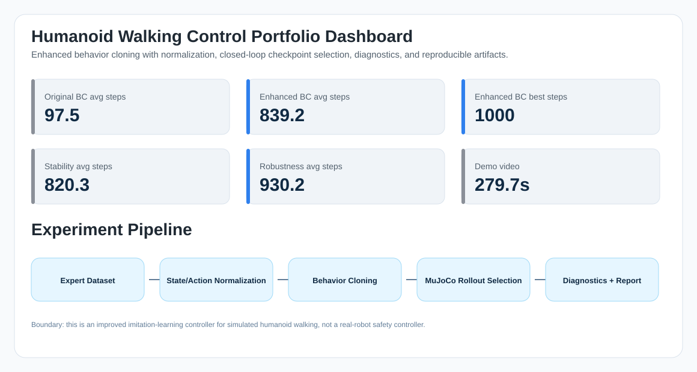

# Visual Gallery

This gallery collects the visual evidence used to explain the humanoid walking control project.

## Overview Dashboard

## Long-horizon walking keyframes

Eight frames sampled from the final demo video, covering 14.0s to 265.7s.

## Closed-loop performance comparison

Average episode length improves from the original BC retrain to the rollout-selected enhanced BC.

## Enhanced BC training loss

Training and validation MSE curves for the normalized behavior cloning policy.

## Rollout-based checkpoint selection

MuJoCo closed-loop rollout is used to select the checkpoint, instead of relying only on validation MSE.

## Episode stability diagnostics

Episode steps and action-delta diagnostics help identify whether the controller is stable or only lucky.

## Robustness and action smoothing sweep

Naive deployment-time action smoothing reduces performance for this learned gait.
