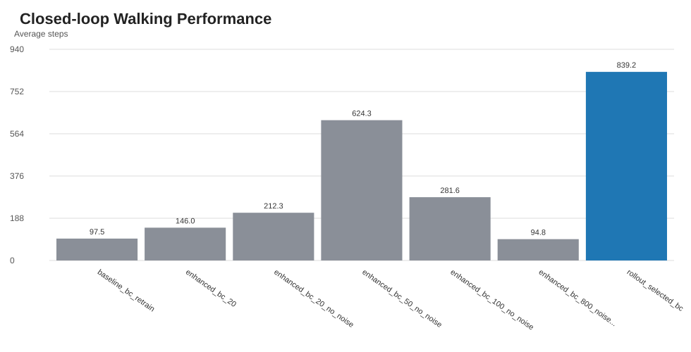
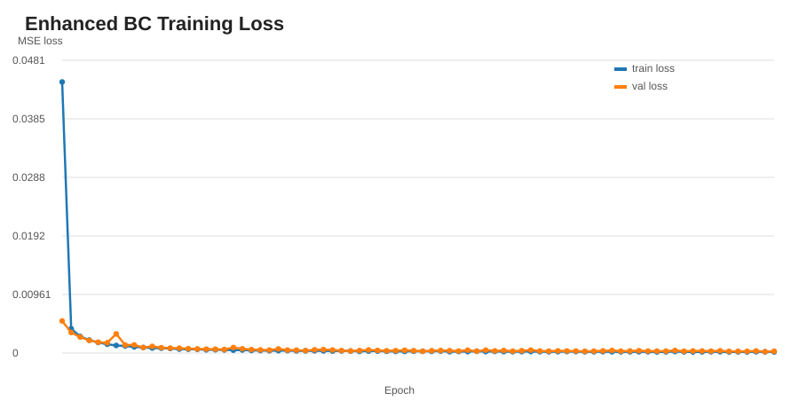
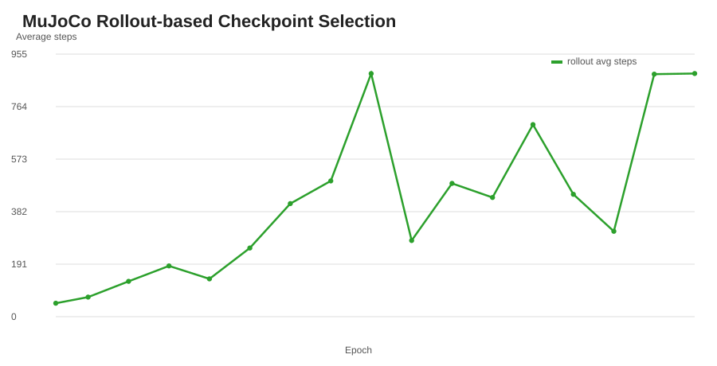
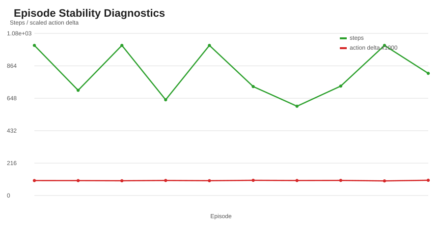
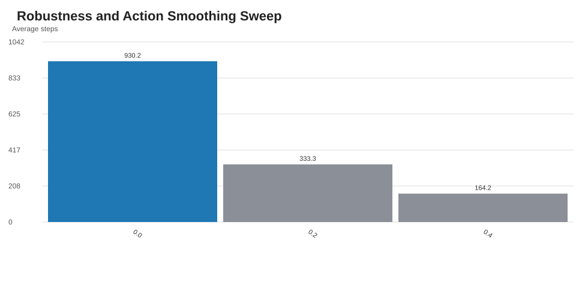
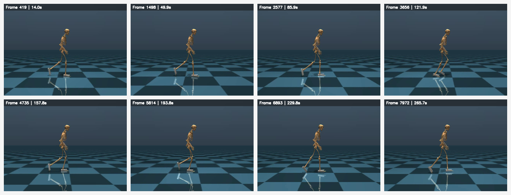

# Portfolio Experiment Summary

This report is generated from the saved CSV artifacts in `portfolio_retrain_bc_improved/`.

## Main Result

- Average steps: 839.2
- Best steps: 1000
- Average reward: 776.75
- Best reward: 951.50

## Stability Diagnostics

- Diagnostic average steps: 820.3
- Average action norm: 0.540
- Average action delta: 0.100

## Robustness Sweep

- Best smoothing value: 0.0
- Sweep average steps: 930.2
- Sweep success rate: 50.00%

The sweep shows that naive action smoothing hurts this controller, so the final policy uses the raw normalized BC action.

## Artifact Validation

- Passed checks: 31/31
- Failed checks: 0

## Figures

- 
- 
- 
- 
- 

## Video Keyframes

- 
